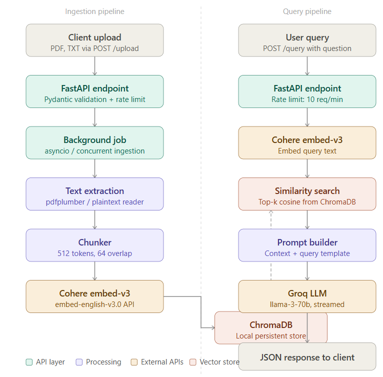

# RAG Question Answering API

A production-ready Retrieval-Augmented Generation (RAG) API built with FastAPI.
Upload PDF or TXT documents, then ask natural language questions against them.

**Stack:** FastAPI · Cohere embed-v3 · ChromaDB · Groq (llama3-70b)

---

## Architecture



See `docs/design_decisions.md` for rationale on chunk size, a documented
retrieval failure case, and latency metrics.

---

## Setup

### 1. Clone and create a virtual environment

```bash
git clone https://github.com/your-username/rag-qna.git
cd rag-qna
python -m venv .venv
source .venv/bin/activate   # Windows: .venv\Scripts\activate
```

### 2. Install dependencies

```bash
pip install -r requirements.txt
```

### 3. Configure environment variables

```bash
cp .env.example .env
```

Edit `.env` and fill in your API keys:

```
COHERE_API_KEY=your_cohere_api_key_here
GROQ_API_KEY=your_groq_api_key_here
CHROMA_PERSIST_DIR=./chroma_store
```

- **Cohere key:** https://dashboard.cohere.com/api-keys
- **Groq key:** https://console.groq.com/keys

### 4. Run the server

```bash
python main.py
```

The API will be available at `http://localhost:8000`.
Interactive docs: `http://localhost:8000/docs`

---

## API Reference

### `POST /upload`

Upload a PDF or TXT file for ingestion.

```bash
curl -X POST http://localhost:8000/upload \
  -F "file=@your_document.pdf"
```

**Response:**
```json
{
  "document_id": "3f7a2c1e-...",
  "filename": "your_document.pdf",
  "status": "queued",
  "message": "Document accepted. Ingestion running in background."
}
```

Rate limit: 5 requests/minute per IP.

---

### `GET /documents/{document_id}`

Poll ingestion status.

```bash
curl http://localhost:8000/documents/3f7a2c1e-...
```

**Response:**
```json
{
  "document_id": "3f7a2c1e-...",
  "filename": "your_document.pdf",
  "status": "ready",
  "chunk_count": 42,
  "ingested_at": "2025-04-01T10:23:00Z",
  "error": null
}
```

Status values: `queued` → `processing` → `ready` | `failed`

---

### `GET /documents`

List all uploaded documents and their statuses.

```bash
curl http://localhost:8000/documents
```

---

### `POST /query`

Ask a question against all documents, or scope to one document.

```bash
curl -X POST http://localhost:8000/query \
  -H "Content-Type: application/json" \
  -d '{
    "question": "What are the main risk factors discussed?",
    "top_k": 5
  }'
```

To scope to a specific document:
```json
{
  "question": "Summarise the methodology section.",
  "document_id": "3f7a2c1e-...",
  "top_k": 3
}
```

**Response:**
```json
{
  "question": "What are the main risk factors discussed?",
  "answer": "The document identifies three main risk factors: ... (source: report.pdf)",
  "sources": [
    {
      "chunk_id": "3f7a2c1e-..._0",
      "document_id": "3f7a2c1e-...",
      "filename": "report.pdf",
      "text": "...",
      "similarity_score": 0.8741
    }
  ],
  "latency_ms": {
    "embed_ms": 214.3,
    "search_ms": 3.8,
    "llm_ms": 412.1,
    "total_ms": 631.4
  }
}
```

Rate limit: 10 requests/minute per IP.

---

## Constraints and design notes

- ChromaDB data persists to `./chroma_store/` across restarts.
- The job registry (in-memory) resets on server restart. Document embeddings
  persist in ChromaDB, but status tracking is lost. For production, migrate
  the registry to SQLite or Redis.
- Files are held in memory during ingestion and not written to disk.
- Maximum upload size: 20 MB per file.

---

## Project structure

```
rag-qna/
├── main.py               # FastAPI app, all routes
├── ingestion.py          # Text extraction, chunking, embedding, ChromaDB write
├── retrieval.py          # Query embedding and similarity search
├── llm.py                # Groq prompt builder and answer generation
├── models.py             # Pydantic request/response schemas
├── config.py             # Environment variables and constants
├── requirements.txt
├── .env.example
├── docs/
│   ├── architecture.png          # System architecture diagram
│   └── design_decisions.md       # Chunk size rationale, failure case, metrics
└── README.md
```


